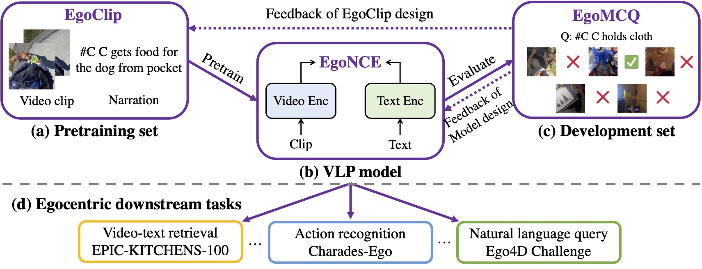
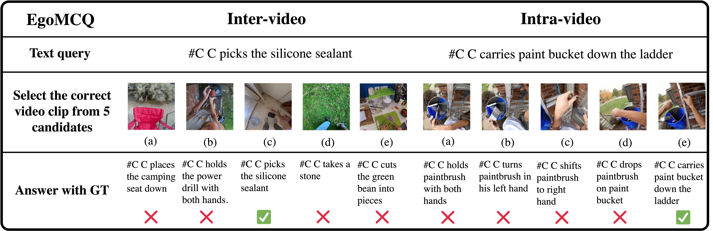

# EgoVLP: Egocentric Video-Language Pretraining

[Project page](https://qinghonglin.github.io/EgoVLP/) | [arXiv](https://arxiv.org/pdf/2206.01670.pdf)

> **TL;DR:** We pioneer Egocentric Video-Language Pretraining from pretraining dataset, model and development benchmark; the resulted pretrained model exhibits strong performance on five downstream tasks across three egocentric datasets.



## 📢 News

- [2022.12.22] We clean the code and provide video features to power NLQ & MQ, Ego4D challenges.
- [2022.9.15] EgoVLP got accepted by [**NeurIPS 2022**](https://nips.cc/) as **Spotlight**!
- [2022.6.30] We release the first version of the EgoVLP codebase.
- [2022.6.20] Our EgoVLP won [**1st place** in OSCC](https://eval.ai/web/challenges/challenge-page/1627/overview) & [**2nd place** in NLQ](https://eval.ai/web/challenges/challenge-page/1629/overview) & [**3rd place** in PNR](https://eval.ai/web/challenges/challenge-page/1622/overview) @ [Ego4D  Challenge 2022](https://ego4d-data.org/docs/challenge/), and [**1st place** in Multi-Instance Retrieval](https://codalab.lisn.upsaclay.fr/competitions/617#learn_the_details) @ [EPIC-Kitchens Challenge 2022](https://epic-kitchens.github.io/2022), hosted by CVPR 2022.
- [2022.6.10] We release the EgoClip pretraining dataset.
- [2022.6.3] We release the arXiv paper.

## 📝 Preparation
### Install dependencies 
```bash
conda env create -f environment.yml
source activate egovlp
```

### Ego4D videos and metadata
> You can skip the source video download if pretraining is not required.
1. Follow the guideline [here](https://ego4d-data.org/docs/start-here/#cli-download), download the following to  `{PATH_TO_EGO4D}`
   - Ego4D source videos (nearly 7 TB).
   - Ego4D videos metadata `manifest.csv` and benchmark metadata, e.g., `nlq_train.json` for NLQ.
   - Create the dir `dataset` and add a soft link by `ln -s {PATH_TO_EGO4D} dataset/ego4d`.

2. For effectively pretraining, we compress videos in the following way:
   - Resize the source videos with a short size equal to 256 by script  `utils/video_resize.py`.
   - Chunk the resized videos to multiple segments (up to 600 sec) by script `utils/video_chunk.py`.

### EgoClip: an egocentric video-language pretraining dataset
- Download the EgoClip metadata from [here](https://drive.google.com/file/d/1-aaDu_Gi-Y2sQI_2rsI2D1zvQBJnHpXl/view?usp=sharing) and put it to `dataset/egoclip.csv`.

- For the usage of EgoClip, please see our dataloader `data_loader/EgoClip_EgoMCQ_dataset.py`. The data format of EgoClip is:
  ```python
  import pandas as pd
  
  metadata = pd.read_csv('dataset/egoclip_metadata.csv', sep='\t', error_bad_lines=False)
  print(metadata.shape[0])
  print(metadata.iloc[0])
  
  # Out:
  3847723                                                         # Num of clips for EgoClip
  
  clip_idx                                                     0  # the idx of clip
  video_uid                 001e3e4e-2743-47fc-8564-d5efd11f9e90  # the uid of source video
  video_dur                                           128.033333  # the duration of source video
  narration_source                              narration_pass_1  # the source of annotator
  narration_ind                                                0  # the idx of narration
  narration_time                                          3.3445  # the narration timestamp
  clip_start                                            2.967651  # the start timestamp of clip
  clip_end                                              3.721266  # the end timestamp of clip
  clip_text           #C C picks a bag of clothes from the floor  # the narration of clip
  tag_verb                                                  [93]  # the verb idx of the narration
  tag_noun                                        [192, 115, 12]  # the noun idx of the narration
  ```
  
^ The terms `tag_verb` and `tag_noun` are used for EgoNCE pretraining objective, which considers synonyms. For example, `pick`, `collect`, `gather` are all belong to the verb parent with idx 93: `take_(pick,_grab,_get)`.
The mapping dictionary can be found [here](https://drive.google.com/drive/folders/16fUv5rrZmt06Ty3QAEweDpveC-84RI9Z?usp=sharing).

### EgoMCQ: an egocentric video-language development set

- Download the EgoMCQ metadata from [here](https://drive.google.com/file/d/1-5iRYf4BCHmj4MYQYFRMY4bhsWJUN3rW/view?usp=sharing) and put it to `dataset/egomcq.json`.
- EgoMCQ is a benchmark for video-language multiple-choice questions. Given a text query, we want the model to choose the correct video clip from five candidates that sampled from two settings: `inter-video` or `intra-video`.
- For the usage of EgoMCQ, please see our dataloader `data_loader/EgoClip_EgoMCQ_dataset.py`.



## 🏋️‍️ Pretraining
This code is built on PyTorch with DistributedDataParallel (DDP). We pretrain EgoVLP on 4 nodes, each with 8 A100 GPUs (10 epochs in about two days).

- Train on EgoClip:  `python3 -m torch.distributed.launch 
  --nnodes=$HOST_NUM 
  --node_rank=$INDEX 
  --master_addr $CHIEF_IP 
  --nproc_per_node $HOST_GPU_NUM 
  --master_port 8081 
  run/train_egoclip.py --config configs/pt/egoclip.json`
  
- Test on EgoMCQ:  `python3 -m torch.distributed.launch 
  --nnodes=$HOST_NUM 
  --node_rank=$INDEX 
  --master_addr $CHIEF_IP 
  --nproc_per_node $HOST_GPU_NUM 
  --master_port 8081 
  run/train_egoclip.py --config configs/eval/egomcq.json`
  
- Monitor the EgoMCQ curve during pretraining: `tensorboard --logdir results  --bind_all`

## 🗄 Pretrained Weights
- We have released our pretrained EgoVLP model (EgoClip w/ EgoNCE) with best performance on EgoMCQ (90.7% inter-video & 57.2% intra-video) in [EgoVLP_PT_BEST](https://drive.google.com/file/d/1-cP3Gcg0NGDcMZalgJ_615BQdbFIbcj7/view?usp=sharing).
- Please download and put the checkpoint under: `pretrained/`

^ This checkpoint is used for EPIC-Kitchens, NLQ, MQ, OSSC, and PNR tasks, except for Charades-Ego. Since we found that VLP (CC3M+WebVid2M, EgoClip) alway degrades significantly on Charades-Ego after the first epoch, we evaluate Charades-Ego using the first pretraining epoch weights of EgoVLP in [EgoVLP_PT_EPO1](https://drive.google.com/file/d/10lRA4Fldt-c5Azh5D2Zvjwi-_YR5ve5e/view?usp=sharing).

^^ You can use our checkpoint to power other egocentric video benchmarks. :)

## 🔧 Downstream Tasks
### EPIC-Kitchens MIR

- **Preparation:**

1. Follow the instruction [here](https://epic-kitchens.github.io/2022), download the EPIC-Kitchens dataset (RGB frames) and annotation to path: `dataset/epic-kitchens/`
2. Follow the instruction [here -> How do I create the relevance matrix?](https://github.com/mwray/Joint-Part-of-Speech-Embeddings) to construct a relevance matrix for evaluation.

- **Results:**

| Model   | Mode                                              | # Frames | Video-Text PT     | Weights                                                 | mAP (V2T) | mAP (T2V) | mAP (Avg) | nDCG (V2T) | nDCG (T2V) | nDCG (Avg) |
| ------- | ------------------------------------------------- | ------ | ----------------- | ------------------------------------------------------------ | --------- | --------- | --------- | ---------- | ---------- | ---------- |
| EgoVLP  | Zero-shot                                         | 4      | EgoClip w/ EgoNCE | [EgoVLP_PT_BEST](https://drive.google.com/file/d/1-cP3Gcg0NGDcMZalgJ_615BQdbFIbcj7/view?usp=sharing) | 19.4      | 13.9      | 16.6      | 24.1       | 22.0       | 23.1       |
| EgoVLP  | Fine-tuning w/<br /> MI-MM                        | 16     | EgoClip w/ EgoNCE | [EgoVLP_FT_EPIC](https://drive.google.com/file/d/1-YEHZ-WBCnO-LZEsDF14jo-pLSJKTp2G/view?usp=sharing) | 49.9      | 40.5      | 45.0      | 60.9       | 57.9       | 59.4       |
| EgoVLP+ | Fine-tuning w/ Adaptive-MI-MM + Dual-softmax | 16     | EgoClip w/ EgoNCE | [EgoVLP_FT_EPIC+](https://drive.google.com/file/d/1-SOQeXc-xSn544sJzgFLhC95hkQsm0BR/view?usp=sharing) | **53.8**  | **40.9**  | **47.4**  | **63.3**   | **59.6**   | **61.4**   |

^ EgoVLP+ means our submission for [Multi-Instance Retrieval@EPIC-Kitchens Challenge 2022](https://arxiv.org/abs/2207.01334), which equips Adaptive MI-MM loss and Dual-softmax for prediction.

- Train: `python3 -m torch.distributed.launch --nnodes=$HOST_NUM  --node_rank=$INDEX  --nproc_per_node $HOST_GPU_NUM --master_port 8081 run/train_epic.py --config configs/ft/epic.json`

- Test: `python3 run/test_epic.py`

### Charades-Ego
- **Preparation:**

1. Follow the instruction [here](https://prior.allenai.org/projects/charades-ego), download the Charades-Ego dataset (480p) and annotation to path: `dataset/charades/`
2. Create a training metadata via `utils/charades_meta.py` 

- **Results:**

| Model  | Mode        | # Frames | Video-Text PT     | Weights | mAP  |
| ------ | ----------- | -------- | ----------------- | ----------------- | ---- |
| EgoVLP | Zero-shot   | 16       | EgoClip w/ EgoNCE | [EgoVLP_PT_EPO1](https://drive.google.com/file/d/10lRA4Fldt-c5Azh5D2Zvjwi-_YR5ve5e/view?usp=sharing)                  | 25.0 |
| EgoVLP | Fine-tuning w/ InfoNCE| 16       | EgoClip w/ EgoNCE | [EgoVLP_FT_CHARADES](https://drive.google.com/file/d/1-xWVDH7XO4pi6Hj5QRpKVz6y-QkqcFlQ/view?usp=sharing)                  | **32.1** |

- Train: `python3 -m torch.distributed.launch --nnodes=$HOST_NUM  --node_rank=$INDEX  --nproc_per_node $HOST_GPU_NUM --master_port 8081 run/train_charades.py --config configs/ft/charades.json`

- Test: `python3 run/test_charades.py`

### NLQ @ Ego4D
- **Preparation:** 

1. Make sure you have prepared the NLQ metadata. 
2. For the video branch, download the EgoVLP clip-level features for NLQ. ^ We get these dense video features (fps=1.87) by script `run/test_nlq.py`.
   - [NLQ Train & Val](https://drive.google.com/file/d/1TXBlLDqDuL_XPCuXlgiikEfVXO8Ly6eM/view)
   - [NLQ Test](https://drive.google.com/file/d/1-CGZg9t-kpW5bmg9M62VHk5eYTllsPKV/view)
3. For the text branch, you can extract EgoVLP text features: `python3 run/test_nlq.py --subsample 'text'` or use our pretrained text encoder.
4. Fine-tune the [VSLNet](https://github.com/EGO4D/episodic-memory/tree/main/NLQ/VSLNet) or other methods by replacing their input video-text features.

^ We provide [our VSLNet codebase](https://github.com/QinghongLin/EgoVLP_episodic_memory) which adapts EgoVLP features as an example, you can refer to the data loader and text encoder.

^ Our EgoVLP brings consistent improvement over multiple NLQ challenge baselines. 

| Model  | Video-Text Pre-extrated Features        | R@1, IoU=0.3 | R@5, IoU=0.3  | R@1, IoU=0.5 | R@5, IoU=0.5   |
| ------ | ----------- | -------- | ----------------- | ----------------- | ---- |
| [VSLNet](https://github.com/EGO4D/episodic-memory/tree/main/NLQ/VSLNet) | SlowFast + BERT  | 5.45 | 10.74 | 3.12 | 6.63
| [VSLNet](https://github.com/EGO4D/episodic-memory/tree/main/NLQ/VSLNet) | EgoVLP | **10.84** | **18.84** | **6.81** | **13.45**
| [CONE](https://arxiv.org/abs/2209.10918) | SlowFast + BERT  | 10.40 | 22.74 | 5.03 | 11.87
| [CONE](https://arxiv.org/abs/2209.10918) | EgoVLP | **14.15** | **30.33** | **8.18** | **18.02**

### MQ @ Ego4D
- **Preparation:**

1. Make sure you have prepared the MQ metadata.
2. Download the EgoVLP clip-level features for MQ. ^ We get these dense video features (fps=1.87) by script `run/test_mq.py`.
   - [MQ Train & Val]( https://drive.google.com/file/d/1-HEUCdyfNX7CBZhz40yiyTr7to_p7wUi/view )
   - [MQ Test]( https://drive.google.com/file/d/1-JmezY3eIkHKJ1JBA_AA8QWBoY3W2HpS/view)
3. Fine-tune the [VSGN](https://github.com/EGO4D/episodic-memory/tree/main/MQ) or other methods by replacing their input video features.

^ We provide [our VSGN codebase](https://github.com/QinghongLin/EgoVLP_episodic_memory) which adapts EgoVLP features as an example, you can refer to the data loader.

^ Our EgoVLP brings consistent improvement over multiple MQ challenge baselines. 

| Model  | Video Pre-extrated Features         | R@1, IoU=0.5 | R@5, IoU=0.5   | mAP
| ------ | ----------- | --------  | ---- | ---- |
| [VSGN](https://github.com/EGO4D/episodic-memory/tree/main/MQ) | SlowFast  | 25.16 | 46.18 | 6.03
| [VSGN](https://github.com/EGO4D/episodic-memory/tree/main/MQ) | EgoVLP | **30.14** | **51.98** | **11.39** |
| [ActionFormer](https://arxiv.org/pdf/2211.09074.pdf) | SlowFast + Omnivore  | 33.46 | - | 17.17
| [ActionFormer](https://arxiv.org/pdf/2211.09074.pdf) | SlowFast + Omnivore + EgoVLP | **36.84** | - | **20.90** | -

### OSCC @ Ego4D
- **Preparation:**
 
1. Make sure you have prepared the OSCC videos and metadata.
2. Extract the clip frame follow the instruction [here -> Data Preparation](https://github.com/EGO4D/hands-and-objects/tree/main/state-change-localization-classification/i3d-resnet50).

- Train: `python3 -m torch.distributed.launch --nnodes=$HOST_NUM  --node_rank=$INDEX  --nproc_per_node $HOST_GPU_NUM --master_port 8081 run/train_oscc.py --config configs/ft/oscc.json`

| Model  | Video-Text Pretrained | OSCC Acc %
| ------ | ----------- | --------  | 
| TimeSformer | ImageNet Init. | 70.3
| TimeSformer | EgoVLP | **73.9** |

### PNR @ Ego4D
- **Preparation:** Same as OSCC.
- Train: `python3 -m torch.distributed.launch --nnodes=$HOST_NUM  --node_rank=$INDEX  --nproc_per_node $HOST_GPU_NUM --master_port 8081 run/train_pnr.py --config configs/ft/pnr.json`

| Model  | Video-Text Pretrained | PNR Err %
| ------ | ----------- | --------  | 
| TimeSformer | ImageNet Init. | 0.616
| TimeSformer | EgoVLP | 0.622 |

^ We found VLP effect is minor in the PNR task.

## 🎓 Citation

If you find our work helps, please cite our paper.

```bibtex
@article{kevin2022egovlp,
  title={Egocentric Video-Language Pretraining},
  author={Lin, Kevin Qinghong and Wang, Alex Jinpeng and Soldan, Mattia and Wray, Michael and Yan, Rui and Xu, Eric Zhongcong and Gao, Difei and Tu, Rongcheng and Zhao, Wenzhe and Kong, Weijie and others},
  journal={arXiv preprint arXiv:2206.01670},
  year={2022}
}
```

## ✉️ Contact

This repo is maintained by [Kevin](https://github.com/QinghongLin). Questions and discussions are welcome via `kevin.qh.lin@gmail.com`.

We are willing to merge results and codes if transfer our EgoVLP to other egocentric tasks or datasets.

## 🙏 Acknowledgements

This codebase is based on [Frozen](https://github.com/m-bain/frozen-in-time). 

Thanks to [Alex](https://github.com/fingerrec) for the help with DDP and [Mattia](https://github.com/Soldelli) for the help with NLQ and MQ benchmarks.

## LICENSE

MIT
